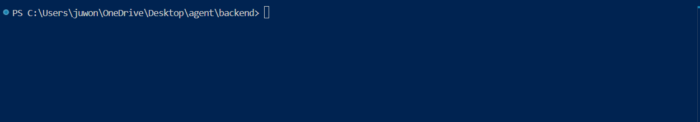

# HarnessAI

🌐 [English](README.md) · **한국어**

> *AI 에이전트가 짜되, 당신 규칙대로 짜게 하는 오케스트레이터.*

AI가 코드를 잘 짜는 건 알지만 **내 스타일대로 짜지는 않는다**. 기획 범위를 넘고, 허용 안 한 라이브러리를 쓰고, 에러 처리가 내 기준과 다르다. 직접 고치다 보면 결국 내가 다 짜는 거랑 같다.

HarnessAI 는 그 문제를 닫힌 루프로 푼다:

1. **계약서** (`skeleton.md` — 30개 표준 섹션, **사용자 6축 답변에 따라 자동 활성화**) 에 무엇을 만들지 먼저 선언
2. **7개 에이전트** (Architect · Designer · Orchestrator · Backend/Frontend Coder · Reviewer · QA) 가 선언대로 구현
3. **9개 품질 게이트** 가 계약 위반을 자동 차단 — 보안 훅 6 + ai-slop + 테스트 분포 + skeleton 정합성

AI 를 대체하는 게 아니라 **통제하는** 도구다.

---

## 🎯 실제로 무엇을 잡아내는가

일반 Claude 가 짜는 코드 — 테스트 통과, 린트 통과, 정상 동작:

```python
_BACKOFF_SECONDS = (1.0, 2.0, 4.0, 8.0)   # 4개 백오프 단계 선언
max_retries = 2
for i in range(max_retries):              # 그런데 2개만 사용
    time.sleep(_BACKOFF_SECONDS[i])
```

상수는 4개를 선언했는데 루프는 2개만 읽는다. 어떤 테스트도 못 잡는 dead code — 프로그램이 정상 동작하기 때문. 실제 사례 — dogfooding 로그의 [LESSON-018](docs/benchmarks/dogfooding-catches.md).

`/ha-review` 의 `ai-slop` 훅(9개 게이트 중 7번째) 이 잡아낸다:

```json
{
  "hook": "ai-slop",
  "severity": "WARN",
  "message": "dead 상수 의심 (LESSON-018) — 상수 정의 범위 vs 실제 사용 범위 확인",
  "snippet": "_BACKOFF_SECONDS = (1.0, 2.0, 4.0, 8.0)\n+max_retries = 2"
}
```

LLM 이 자주 만드는데 사람 리뷰에서 놓치는 종류의 실수. **35개 fixture** 에서 9개 게이트가 **precision 100% / recall 100%** — [gate-coverage.md](docs/benchmarks/gate-coverage.md).

---

## 🎯 실제로 어떻게 맞춤되는가



같은 `python-cli` 프로파일, 두 가지 인터뷰 답변 → 다른 skeleton.

**기본선 — `data_sensitivity=none / lifecycle=poc / availability=casual` → 13 섹션**

```
overview · stack · errors · interface.cli · core.logic ·
configuration · persistence · data_model · external_deps ·
integrations · requirements · tasks · notes
```

**상향 — `data_sensitivity=pii / lifecycle=mvp / availability=standard` → 18 섹션** (기본선 13 **+** 아래 5):

| + 섹션           | `required_when` 룰                                                  | 이 답변이 활성화한 이유                          |
|------------------|---------------------------------------------------------------------|--------------------------------------------------|
| `audit_log`      | `data_sensitivity in [pii, payment]`                                 | 민감 데이터 → compliance 로그                    |
| `threat_model`   | `data_sensitivity in [pii, payment] or availability == high`         | 민감 데이터 → STRIDE/OWASP                       |
| `ci_cd`          | `lifecycle in [mvp, ga]`                                             | mvp 이상 → 파이프라인 / 롤백                     |
| `test_strategy`  | `lifecycle in [mvp, ga]`                                             | mvp 이상 → 테스트 피라미드 / 컨트랙트 테스트     |
| `slo`            | `user_scale in [medium, large] or availability in [standard, high]`  | "standard" 가용성만 돼도 → p50/p95/p99 예산      |

6축 (`user_scale` / `data_sensitivity` / `team_size` / `availability` / `monetization` / `lifecycle`) 은 `/ha-init` 가 받음. 각 fragment 의 표현식은 [`scale_expression.py`](backend/src/orchestrator/scale_expression.py) 가 파싱 → 6축에 평가 → `ProfileLoader.compute_active_sections` 가 활성 섹션 목록 반환. 룰은 `harness/templates/skeleton/*.md` frontmatter 에 — 완전 투명, 바꾸면 로더가 즉시 반영.

**재현** (clean clone 에서, 에이전트 호출 없이):

```bash
cd backend && uv run python ../scripts/show_adapt_diff.py
# A  pii + mvp + standard  ->  18 sections
# B  none + poc + casual   ->  13 sections
# diff (A only)            ->  ['audit_log', 'ci_cd', 'slo', 'test_strategy', 'threat_model']
```

---

## 🚀 30초 사용법

```bash
git clone https://github.com/reasonableplan/harnessai.git
cd harnessai
./install.sh                          # Windows: .\install.ps1
export HARNESS_AI_HOME="$(pwd)"       # (설치 스크립트가 안내)
```

새 Claude Code 세션에서:

```
/ha-init     # 스택 감지 + 인터뷰 → harness-plan.md + skeleton.md
/ha-design   # Architect+Designer 가 skeleton 섹션 채움
/ha-plan     # Orchestrator 가 tasks.md 로 분해
/ha-build T-001          # 태스크별 구현 [sonnet]
/ha-verify   # toolchain 실행 + skeleton 정합성 게이트 [sonnet]
/ha-review   # 보안훅 + LESSON + ai-slop + 테스트 분포 종합 리뷰
```

> 세부: [ARCHITECTURE.ko.md](docs/ARCHITECTURE.ko.md) · [SETUP.md](SETUP.md)

---

## 🏗 파이프라인

```
               ┌─ profile 감지 (~/.claude/harness/profiles/) ────┐
               │                                                 │
  /ha-init ───▶│ harness-plan.md  +  skeleton.md (빈 템플릿)      │
               └─────────────────────────┬───────────────────────┘
                                         ▼
  /ha-design ─────▶ Architect + Designer (협의 최대 3회) ─▶ skeleton 채움
                                         ▼
  /ha-plan   ─────▶ Orchestrator ─▶ tasks.md (의존성 그래프)
                                         ▼
  /ha-build  ─────▶ Backend/Frontend Coder ─▶ 구현 파일
    │                                 [--parallel T-001,T-002  ← ultrawork]
    ▼
  /ha-verify ─────▶ [1] harness integrity (skeleton ↔ 실재 FS)
                    [2] profile toolchain (pytest/ruff/pyright)
                                         ▼
  /ha-review ─────▶ 보안훅 6 + LESSON 21 + ai-slop 7 + 테스트 분포
                                         ▼
                               APPROVE / REJECT → /ship
```

각 단계 앞뒤에 gstack 스킬 연계 가능 (`/office-hours`, `/plan-eng-review`, `/review`, `/qa`, `/ship`, `/retro`).

---

## 🎯 핵심 개념

### 1. 프로파일 — 스택별 규칙 선언

`~/.claude/harness/profiles/<stack>.md` 한 파일에 스택 하나의 모든 규칙을 담는다:
- **감지 규칙** (어떤 파일 있으면 이 스택인지)
- **컴포넌트** (필수/선택)
- **skeleton_sections** (어느 섹션 포함)
- **toolchain** (test/lint/type 명령)
- **whitelist** (허용 의존성)
- **lessons_applied** (강제 적용 LESSON)

기본 5개 스택 제공: `fastapi` · `react-vite` · `python-cli` · `python-lib` · `claude-skill`. 새 스택은 파일 추가만으로 확장.

### 2. Skeleton — 프로젝트 계약서

30개 표준 섹션 ID 중 프로파일이 요구하는 것 + **사용자 6축 답변** 으로 활성 결정:

```
overview · requirements · stack · configuration · errors · auth ·
persistence · integrations · interface.{http,cli,ipc,sdk} ·
view.{screens,components} · state.flow · core.logic ·
observability · deployment · tasks · notes ·
data_model · threat_model · audit_log · slo · runbook ·
test_strategy · user_journey · authorization_matrix · ci_cd · external_deps
```

마지막 10개 (data_model … external_deps) 는 6축에 대해 평가되는 `required_when` 표현식으로 활성 — 아래 [실제로 어떻게 맞춤되는가](#-실제로-어떻게-맞춤되는가) 참조.

섹션 내용이 **계약**. /ha-verify 가 `\`\`\`filesystem` 선언 ↔ 실재 FS 일치 검증, 플레이스홀더 (`<pkg>`, `<cmd_a>`) 미치환 잔존 차단.

### 3. Shared Lessons — 집단 기억

`backend/docs/shared-lessons.md` 에 과거 21개 실수 패턴. 한 번 발생한 버그는 시스템에 기록 → 모든 미래 `/ha-review` 가 참조 → 반복 방지.

예시:
- LESSON-001: FastAPI Query params 반드시 snake_case
- LESSON-013: 프론트엔드 테스트 전략 사전 정의 필수
- LESSON-018: 상수 정의 길이 ≤ 실제 소비 범위 (dead 상수)
- LESSON-020: 진행 표시 `[N/M]` 은 실제 작동해야
- LESSON-021: 태스크 `done` = toolchain 전체 통과 (test + lint + type)

---

## 🆚 비교

| | HarnessAI | Cursor / Copilot | Claude Code (plain) | aider |
|---|---|---|---|---|
| 범위 | 프로젝트 전체 | 파일/함수 단위 | 대화 기반 | diff 기반 |
| 규칙 강제 | **프로파일 + 게이트 9개** | .cursorrules (선언만) | CLAUDE.md (선언만) | 커밋 스타일만 |
| 실수 축적 | **LESSON 21** (자동 감지 + 리뷰어 참조) | ❌ | ❌ | ❌ |
| 스택 자동감지 | **5개 기본 + 확장 가능** | ❌ | ❌ | ❌ |
| 병렬 구현 | **/ha-build --parallel** | ❌ | ❌ | ❌ |
| 설계-구현 계약 | **skeleton.md + integrity 게이트** | ❌ | ❌ | ❌ |

**HarnessAI 가 어울리는 곳**: 여러 개 중소 프로젝트를 같은 품질로 양산. 반복하는 실수를 시스템이 기억하기를 원할 때.

**안 어울리는 곳**: 1회성 스크립트, 탐색적 프로토타입, 이미 코드가 수만 줄인 레거시 (deepinit 필요).

---

## 📦 설치

```bash
# Unix / WSL / macOS / Git Bash
./install.sh

# Windows PowerShell
.\install.ps1
```

동작:
- `harness/` + `skills/ha-*` + `skills/_ha_shared` → `~/.claude/` 로 복사
- `~/.claude/harness/.install-manifest.json` 에 SHA256 기록 (재실행 시 diff 감지)
- `--force` / `--dry-run` 지원
- `CLAUDE_HOME=/custom/path ./install.sh` 로 커스텀 타겟

**환경 변수**: 설치 후 `HARNESS_AI_HOME` 을 이 레포 절대 경로로. 스크립트가 끝에 안내한다.

---

## 🧪 품질 게이트 (9개)

| 게이트 | 위치 | 역할 |
|---|---|---|
| 프로파일 whitelist | `security_hooks.py` | 허용 외 의존성 차단 |
| path traversal | ` " ` | `../` 등 상향 참조 차단 |
| secret leak | ` " ` | 토큰/키 하드코딩 감지 |
| CLI arg secret | ` " ` | CLI 인자로 시크릿 전달 금지 |
| SQL injection | ` " ` | raw SQL concat 차단 |
| XML delimiter | ` " ` | 에이전트 프롬프트에 사용자 입력 분리 |
| **ai-slop** (7번째) | `ha-review/run.py` | 정규식 7패턴 — 장황한 docstring, 껍데기 try/except, dead 상수(LESSON-018), TODO/FIXME, unused 함수, 임시 pass |
| **테스트 분포** | ` " ` | src 모듈 대비 테스트 편중 감지 (BLOCK: 0개, WARN: 10x 편차) |
| **skeleton 정합성** | `harness integrity` | 선언 경로 ↔ 실재 + 플레이스홀더 검증 |

---

## 🎭 에이전트

| 역할 | 담당 |
|---|---|
| Architect | skeleton 의 DB/API/인증/상태흐름 설계 |
| Designer | UI/UX/컴포넌트 트리/상태관리 설계 |
| Orchestrator | 태스크 분해, 의존성 그래프, Phase 관리 |
| Backend Coder | Python/FastAPI/CLI 구현 |
| Frontend Coder | React/TS 구현 |
| Reviewer | 보안 훅 + LESSON + convention 종합 리뷰 |
| QA | 통합 테스트 시나리오 검증 |

각 에이전트의 규칙은 `backend/agents/<role>/CLAUDE.md` 에서 수정 가능.

---

## ⚠️ 현재 한계

- **Windows 우선 테스트** — Linux/macOS 지원은 설계됐으나 CI 매트릭스 미정
- **LLM 자동 학습 X** — 새 LESSON 은 수동 추가 (자동 학습은 TODOS.md)
- **2차 E2E 진행 중** — 1차(code-hijack, Python CLI) 완주. 2차(fastapi + react-vite 모노레포) Phase 1 완주, Phase 2 진행 중
- **gstack 의존** — 일부 게이트는 gstack 스킬 연계 전제 (독립 실행 가능하나 full power 는 gstack 있을 때)

---

## 🗺 Roadmap

**Phase 1-4 (완료)**: 프로파일 시스템 · 7개 /ha-스킬 · 21 LESSONs · 9개 품질 게이트 · 단일 명령 설치 · /my-\* 스킬 12종 삭제 · v1 레거시 코드 (SECTION_MAP/extract_section/fill_skeleton_template) 제거 · Orchestra v2 wiring

**Phase 5 (계획)**:
- Live LESSONS 자동 학습 (ha-review 반복 패턴 → 후보 등록)
- 추가 프로파일 (next.js, electron, react-native)
- multi-provider (Gemini/OpenAI backend)
- 비용 추적 (에이전트별 토큰/달러 누적)
- Claude Code plugin manifest 로 배포

---

## 🧱 Tech Stack

- **언어**: Python 3.12
- **서버**: FastAPI + WebSocket (포트 3002)
- **패키지**: uv
- **에이전트 실행**: Claude CLI subprocess (Gemini/로컬 LLM 교체 가능)
- **상태**: `docs/harness-plan.md` (YAML frontmatter) + `.orchestra/` JSON (DB 없음)
- **테스트**: pytest **420개** backend + **12개** install 스냅샷 (회귀 0건)
- **타입 체크**: pyright **0 errors** (`src/` 전수)
- **게이트 커버리지 (자기 검증)**: 9개 게이트 중 정규식/AST 기반 7개를 35 fixtures (positive/negative) 로 측정 → **precision 100% / recall 100% / accuracy 100%**. 나머지 2개 (test-distribution, skeleton-integrity) 는 filesystem fixture 로 별도 회귀 테스트. 상세 한계/방법: [gate-coverage.md](docs/benchmarks/gate-coverage.md)
- **성능** (30 iter, LLM 제외): profile 감지 **~5 ms**, skeleton 조립 **<1 ms**, `harness validate` **~150 ms**, `harness integrity` **~104 ms**. [docs/benchmarks/](docs/benchmarks/)
- **v2 인프라**: `profile_loader`, `skeleton_assembler`, `plan_manager`, `harness` 검증 CLI

---

## 📂 디렉토리 구조

```
harness/              프로파일/템플릿/CLI 소스  ─┐
skills/               ha-* 스킬 + _ha_shared    ├─ install.sh → ~/.claude/
install.sh/ps1        설치 + manifest           ─┘

backend/
  agents/<role>/CLAUDE.md     7개 에이전트 시스템 프롬프트 (편집 가능)
  agents.yaml                 provider/model/timeout
  docs/shared-lessons.md      21 LESSONs
  src/orchestrator/           profile_loader / skeleton_assembler /
                              plan_manager / security_hooks / runner
  tests/                      420 pytest + skills/ 회귀 방지

docs/
  ARCHITECTURE.md             시스템 구조 30분 이해
  harness-v2-design.md        상세 작업 로그
```

---

## 🛠 개발

```bash
cd backend
uv sync
uv run pytest tests/ --rootdir=.      # 420 tests
uv run ruff check src/                 # 0 errors
uv run pyright src/                    # 0 errors (타입 체크)
uv run python -m src.main              # dashboard 서버 (포트 3002)
```

install 스크립트 회귀 테스트:
```bash
./tests/install/test_install_snapshot.sh   # 12 assertions
```

harness 스키마 검증:
```bash
python harness/bin/harness validate           # 37 files, 0 errors
python harness/bin/harness integrity --project .   # skeleton ↔ FS 정합성
```

---

## 📚 문서

| 문서 | 내용 |
|---|---|
| [ARCHITECTURE.ko.md](docs/ARCHITECTURE.ko.md) | 시스템 구조 · 프로파일 · skeleton · 게이트 (**먼저 읽으세요**) |
| [docs/decisions/](docs/decisions/) | Architecture Decision Records (ADR 5개) |
| [docs/e2e-reports/](docs/e2e-reports/) | E2E 리포트 — dogfooding 증거 (code-hijack 완주, ui-assistant 진행 중) |
| [docs/benchmarks/](docs/benchmarks/) | 성능 측정 + **게이트 커버리지** (35 fixtures, 100%) + LESSON↔게이트 dogfooding 트레이싱 |
| [CONTRIBUTING.md](CONTRIBUTING.md) | 프로파일/LESSON/게이트/스킬 기여 가이드 |
| [CHANGELOG.md](CHANGELOG.md) | 버전별 변경 이력 |
| [SETUP.md](SETUP.md) | 처음부터 끝까지 설치/실행 가이드 |
| [TODOS.md](TODOS.md) | 향후 개선 항목 |
| [backend/docs/shared-lessons.md](backend/docs/shared-lessons.md) | 21개 과거 실수 패턴 |
| [CLAUDE.md](CLAUDE.md) | 구현 시 엄격 규칙 (현업 시니어 수준) |
| [SECURITY.md](SECURITY.md) | 취약점 보고 프로세스 |
| [CODE_OF_CONDUCT.md](CODE_OF_CONDUCT.md) | 커뮤니티 행동 규범 |
| [docs/harness-v2-design.md](docs/harness-v2-design.md) | v2 재설계 상세 작업 로그 |

---

## License

MIT

---

**포트폴리오 목표**: 현업 시니어 수준의 코드 품질 기준으로 포트폴리오의 정점을 찍기. Phase 1–4 완료, 2차 E2E Phase 1 완주, Phase 2 진행 중.
