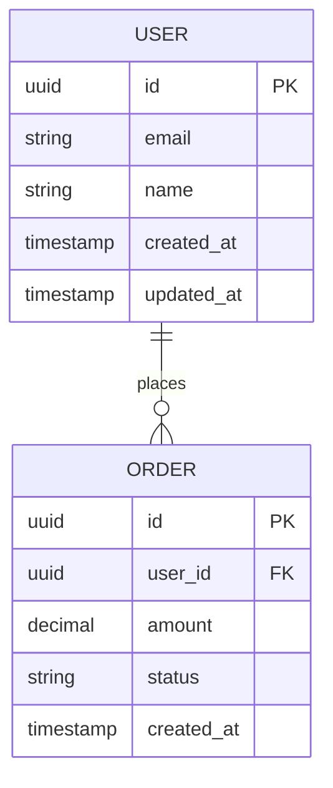

## {{section_number}}. 데이터 모델

### 엔티티 목록

| 엔티티 | 책임 | PII 포함 | 보존 정책 |
|--------|------|:---:|----------|
| `<Entity>` | <한 줄 설명> | ✅/❌ | <soft / hard delete + 보존기간> |

### ERD (Mermaid)

> Mermaid 는 GitHub / VS Code / Obsidian 모두 자동 렌더링.

### 컬럼 명세 (테이블별)

#### `<table_name>`

| 컬럼 | 타입 | Null | 기본값 | PII | 인덱스 | 비고 |
|------|------|:---:|--------|:---:|:------:|------|
| `id` | UUID | ❌ | `gen_random_uuid()` | ❌ | PK | |
| `<col>` | `<type>` | ❌ | — | ❌ | — | |

PII 컬럼은 ✅ 표시 + `audit_log` / `threat_model` / 6축 `data_sensitivity` 와 교차 검증.

### 관계 (Cascade 정책)

| 자식 | 부모 | ON DELETE | ON UPDATE | 이유 |
|------|------|-----------|-----------|------|
| `<child.fk>` | `<parent.id>` | CASCADE / SET NULL / RESTRICT | CASCADE / RESTRICT | <설명> |

### 인덱스 의도

| 대상 | 컬럼/키 | 종류 | 조회 패턴 (왜 필요한가) |
|------|--------|------|------------------------|
| `<table>` | `<col>` | B-tree / GIN / unique | <쿼리 예시> |

### 마이그레이션 정책

- **도구**: `<프로파일별 — Alembic / Drizzle / 수동 SQL / PRAGMA user_version>`
- **방향**: forward-only / reversible — `<선택>`
- **Zero-downtime 룰** (운영 환경 필수, `availability >= standard` 일 때):
  - 컬럼 추가 → nullable + default → 백필 → not null 적용 (3-step)
  - 컬럼 삭제 → 코드에서 사용 제거 → 한 배포 후 컬럼 drop
  - 인덱스 생성 → `CONCURRENTLY` (Postgres) 또는 동등 옵션
  - 큰 테이블 변경 → online schema change 도구 (gh-ost / pt-osc / pg-online-migrate) 고려
- **검토 규칙**: 자동생성 마이그레이션은 수동 검토 + staging 적용 후 prod
- **롤백 절차**: `<마이그레이션 실패 시 되돌리는 절차 — 백업 복원 / down 마이그레이션 / forward-fix>`

### 데이터 보존 / 삭제

- **Soft delete vs Hard delete**: `<엔티티별 정책>`
- **보존 기간**: `<예: 사용자 데이터 5년 / 로그 90일 / 결제 7년 (세무 의무)>`
- **GDPR / PIPA "잊혀질 권리"**: `<사용자 삭제 요청 시 anonymize 또는 hard delete 절차>`

> 작성 가이드:
> - 모든 엔티티에 `created_at`, `updated_at` 권장 (TIMESTAMP WITH TIME ZONE — naive 금지, LESSON-004)
> - ID 타입은 프로젝트 전체 통일 — UUID 또는 BigInt 혼용 금지 (LESSON-007)
> - PII 컬럼은 ✅ 표시 + 데이터 분류 정책과 교차 검증 — `audit_log` + `threat_model` 섹션 참조
> - 외래키는 항상 `ON DELETE` cascade 정책 명시 (LESSON-003 / 일반 누락)
> - `persistence` 가 "PostgreSQL + Alembic" 같은 도구 결정이라면, `data_model` 은 그 위의 **스키마 + 정책**
