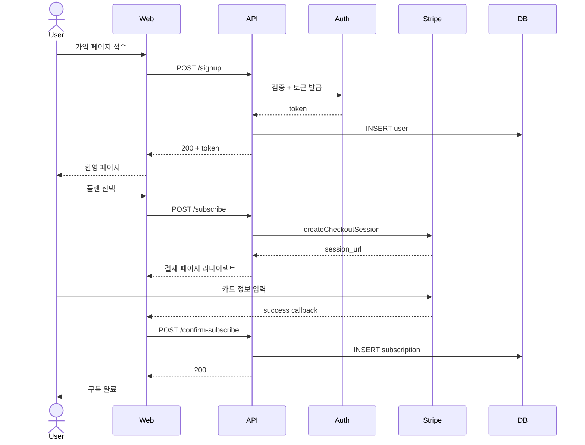
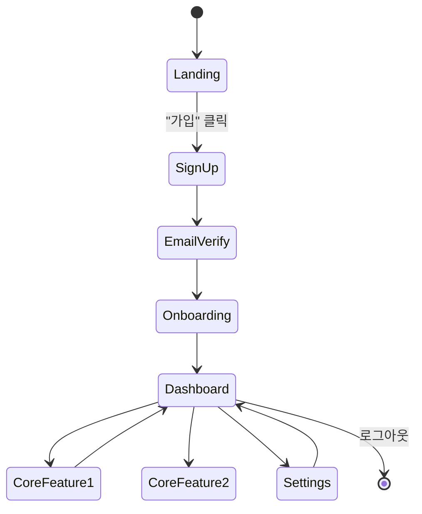

## {{section_number}}. 사용자 시나리오 (User Journey)

### 페르소나

| 페르소나 | 역할 | 동기 (왜 우리 서비스를 쓰는가) | 좌절 (현재 어떻게 풀고 있나) |
|---------|------|-------------------------------|------------------------------|
| `<Primary>` | <역할 / 직군> | <달성하려는 가치> | <기존 방식의 한계> |
| `<Secondary>` | <역할> | <부수 가치> | <한계> |

페르소나는 **구체적**으로 — "30대 직장인" 보다 "주 2회 야근하는 30대 IT 기획자, 독서 시간 부족" 처럼.

### 핵심 시나리오 (Happy Path)

#### 시나리오 1: `<예: 신규 사용자 첫 결제>`

**가치 도착점**: <이 시나리오 끝에서 사용자가 얻는 것 — 구독 활성화 / 첫 기능 사용 가능>

**측정 지표** (analytics — Phase 3):
- 시작 → 완료 conversion: <목표 N%>
- 단계별 drop-off: <어디서 가장 많이 이탈하는가>

#### 시나리오 2: `<예: 일상 사용 — 핵심 액션>`

(같은 형식으로 작성)

#### 시나리오 3: `<예: 핵심 가치 재방문>`

(같은 형식으로)

### 화면 전이 (State Diagram)

### Edge Case / Unhappy Path

| 시나리오 | 발생 빈도 | 처리 | UX |
|---------|----------|------|-----|
| 결제 카드 거부 | 자주 | 다른 카드 안내 | 명확한 에러 + 재시도 버튼 |
| 외부 의존 다운 (Stripe / OAuth) | 드물지만 치명 | `external_deps` 폴백 | 상태 페이지 링크 + 재시도 안내 |
| 권한 부족 | 가끔 | `authorization_matrix` 의 거부 응답 | 어떤 권한이 필요한지 안내 |
| 데이터 미존재 (404) | 자주 | 빈 상태 화면 | "없음" + 다음 액션 제안 |
| 네트워크 오류 | 자주 | retry / offline 안내 | optimistic update + rollback 또는 명확한 실패 |

### 접근성 (a11y) 핵심 흐름 (Phase 3 의 a11y 와 결합)

- 키보드만으로 핵심 시나리오 1 완수 가능 (Tab / Enter / Esc)
- 스크린리더로 핵심 시나리오 1 완수 가능 (ARIA labels + landmark)
- 색상만으로 정보 전달 금지 (텍스트 + 아이콘 병행)

> 작성 가이드:
> - 핵심 시나리오는 3-5개로 — 모든 기능을 시나리오화하지 말 것 (가치 흐름 중심)
> - Mermaid sequenceDiagram 은 외부 호출 흐름 / stateDiagram 은 화면 / flowchart 는 의사결정
> - Happy path 만 적지 말 것 — edge case 가 사용자 경험을 결정
> - `view.screens` 가 화면별 명세라면 user_journey 는 그 화면들을 잇는 시퀀스
> - 측정 지표 정의는 출시 전 필수 — 안 정하면 retention 도 측정 못 함
